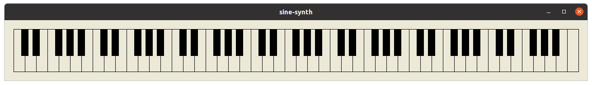

# sine-synth



`sine-synth` is a primitive synthesizer demo program written in C#.  It displays a keyboard and lets you click on keys to play notes.  The only sound it makes is sine waves.  It plays output through the cross-platform audio library [PortAudio](http://www.portaudio.com/), using the [PortAudio.Net](https://github.com/Kyle-Gagner/PortAudio.Net) wrapper library.

## Getting the sources

Be sure to use git-clone --recursive since this project includes (a slightly modified version of) [PortAudio.Net](https://github.com/Kyle-Gagner/PortAudio.Net) as a git submodule.

## Building and running on Linux


```
$ make
```

To run, you will need to have the PortAudio shared library installed.  On Ubuntu, install the `libportaudio2` package.

```
$ mono synth.exe
```

## Building and running on Windows

```
C:\sine-synth> dotnet build
```

To run, you will need a PortAudio binary DLL.  You can download binaries for Windows from the [portaudio-binaries](https://github.com/spatialaudio/portaudio-binaries) GitHub project.  You want the 64-bit DLL.  Rename it from `libportaudio64bit.dll` to `libportaudio.dll` and put it either in somewhere your PATH, or in the bin\Debug directory where the sine-synth binaries are generated.

```
C:\sine-synth> bin\debug\sine-synth
```


